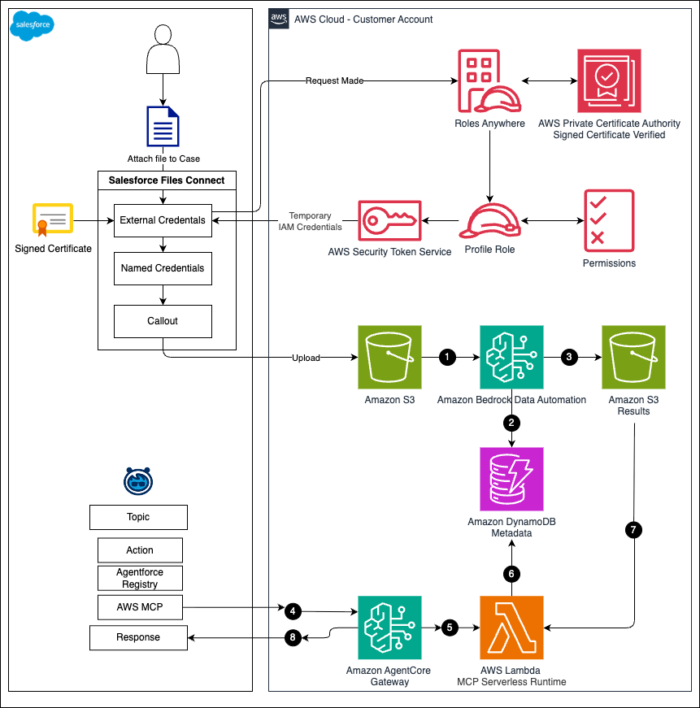

# Extending Public Sector Intelligence with Agentforce and AWS

> **Sample code** — This repository accompanies the AWS blog post *Extending Public Sector Intelligence with Agentforce and AWS*. It is intended as a reference implementation demonstrating how to extend [Salesforce Agentforce](https://www.salesforce.com/agentforce/) with AWS services through an [Amazon Bedrock AgentCore Gateway](https://aws.amazon.com/bedrock/agentcore/) using the Model Context Protocol (MCP). This is **not** a production-ready workload. Review, harden, and test any adaptation before deploying to production environments.

---

## What This Sample Shows

Public sector agencies process large volumes of unstructured evidence — body camera footage, surveillance video, scanned documents, photographs, and audio recordings — that require manual review before anyone can act on them. This sample demonstrates how to:

1. **Process unstructured data with AI** — Automatically extract insights from documents, images, video, and audio using [Amazon Bedrock Data Automation](https://aws.amazon.com/bedrock/data-automation/).
2. **Expose those insights to Agentforce via MCP** — Surface document summaries and semantic search capabilities to Salesforce Agentforce agents through an Amazon Bedrock AgentCore Gateway MCP endpoint.

With this pattern, Agentforce users can ask natural language questions about case evidence and receive AI-powered answers without leaving the Salesforce UI or managing AWS resources directly.

### How It Builds on Previous Work

This project extends the pattern established in [Modernizing evidence management in Salesforce Public Sector Solutions with Amazon S3](https://aws.amazon.com/blogs/publicsector/modernizing-evidence-management-in-salesforce-public-sector-solutions-with-amazon-s3/). That post set up durable, cost-efficient storage for evidence files using the External Storage of Files with Amazon S3 connector. This sample adds the intelligence layer — processing those stored files and making the results available through MCP.

---

## Architecture



### End-to-End Flow

| Step | What Happens |
|------|-------------|
| 1 | Documents uploaded to Amazon S3 (via the Agentforce Public Sector connector) trigger processing |
| 2 | Amazon Bedrock Data Automation processes the file based on media type — extracting text, generating summaries, transcribing audio/video |
| 3 | Amazon DynamoDB assigns a document ID and stores metadata alongside BDA-generated insights |
| 4 | Processed results are saved to a dedicated output bucket in Amazon S3 |
| 5 | A Salesforce user's chat in Agentforce triggers an action that calls AWS through MCP via the Amazon Bedrock AgentCore Gateway |
| 6 | The call authenticates through Amazon Cognito OAuth 2.0 (client_credentials flow), and the gateway invokes an MCP server on AWS Lambda |
| 7 | The Lambda function queries DynamoDB to locate document records, then retrieves results from S3 |
| 8 | Results are returned to Agentforce and loaded into the agent's context for a natural language response |

> **Note — file extensions are matched case-sensitively.** Processing is triggered by S3 event notification suffix filters, which match object keys exactly (no wildcards, case-sensitive). An extension configured as `.jpg` will not match an upload named `photo.JPG`, so that file is stored but never processed. This sample ships extensions in lowercase and does not normalize casing for you; you can normalize the extension before upload, register the specific cased variants, or validate case-insensitively in the ingestion Lambda. See [cdk/README.md](cdk/README.md#extension-matching-is-case-sensitive) for the options and their tradeoffs.

---

## Stacks Deployed

The CDK application deploys two CloudFormation stacks:

### BdaProcessingStack

Handles document ingestion and AI processing.

| Resource | Purpose |
|----------|---------|
| S3 Buckets (2) | Document storage + access logging |
| Lambda Functions | `InvokeBDAProject` (triggers BDA), `BDAEventProcessor` (handles completion events) |
| DynamoDB Tables (2) | Document metadata (with GSIs for job_id and salesforce_object_id) + counters |
| EventBridge Rule | Fires on BDA job completion |
| IAM Roles | Least-privilege execution roles |

### McpGatewayStack

Exposes AI-powered tools to Agentforce through an Amazon Bedrock AgentCore Gateway.

| Resource | Purpose |
|----------|---------|
| Amazon Bedrock AgentCore Gateway | OAuth-secured MCP endpoint for tool invocation |
| Lambda Function (`McpTools`) | Implements `get_document_summaries` and optionally `semantic_search` |
| Step Functions (Express) | Orchestrates DynamoDB query + S3 retrieval |
| Cognito User Pool + App Client | OAuth 2.0 client_credentials authentication |
| IAM Roles | Scoped permissions for Bedrock KB retrieve, S3 read, DynamoDB query |

---

## Prerequisites

Before you begin:

1. **Complete the previous post** — [Modernizing evidence management in Salesforce Public Sector Solutions with Amazon S3](https://aws.amazon.com/blogs/publicsector/modernizing-evidence-management-in-salesforce-public-sector-solutions-with-amazon-s3/). This sample builds directly on that foundation.
2. **Verify Agentforce MCP support** — In Salesforce Setup, navigate to **Setup > Agentforce Registry** and confirm the option to register an MCP server is available.

Additionally, ensure you have:

- **AWS CLI** installed and configured (`aws sts get-caller-identity` should succeed)
- **AWS CDK v2** installed globally (`npm install -g aws-cdk`)
- **Node.js 18+** (required by CDK CLI)
- **Python 3.9+** with `pip`
- **An Amazon Bedrock Data Automation project** created in the AWS Console — see [Set Up an Amazon Bedrock Data Automation Project](#set-up-an-amazon-bedrock-data-automation-project) below for step-by-step instructions
- Your **AWS Account ID** and target **region**

---

## Set Up an Amazon Bedrock Data Automation Project

Amazon Bedrock Data Automation (BDA) is the AI service that processes uploaded evidence — extracting text, generating summaries, and transcribing audio/video. This sample does **not** create the BDA project for you; you create it once in the AWS Console (or via API) and pass its ARN to the CDK stack through `deployment.bda-project-arn`. Do this before deploying.

> If you set `features.enable-bda` to `false`, the stack skips all BDA wiring and you can ignore this section. In that mode, files are stored and tracked in DynamoDB but not processed.

### Step 1: Create the Project

1. Open the [Amazon Bedrock console](https://console.aws.amazon.com/bedrock/) in the **same region** you will deploy the stack to (the region in `deployment.region`). BDA is region-specific, and the project ARN must live in your deployment region.
2. In the left navigation, go to **Data Automation → Projects**, then choose **Create project**.
3. Give the project a name (for example, `evidence-processing-dev`) and create it.

### Step 2: Enable Summaries in the Project's Standard Output

This sample reads BDA's **standard output** and expects a natural-language **summary** for each media type. If a modality has no summary enabled, documents of that type produce no useful result for Agentforce.

In the project's standard output configuration, check the summary/generative box for each modality you plan to ingest. The console groups these under each media type:

| Modality | Checkbox to enable |
|----------|--------------------|
| Documents | **Generative Fields → Enable** (generates the document description and document summary; also captions diagrams, charts, and images when element granularity is on) |
| Images | **Generative: Image summarization** (a summary of the image) |
| Video | **Generative: Video summarization** (a summary of the entire video) |
| Audio | **Generative: Audio summary** (a summary of the entire audio) |

**You do not need to enable every modality** — only check the boxes for the ones you actually plan to ingest. Enable a modality only if its file types appear in `cdk/bda-supported-file-types.json`. For example, if you only process documents and images, enable just those two and leave video and audio off. If you narrow the processed file types (see [cdk/README.md](cdk/README.md#supported-file-types)), keep only the matching modalities enabled.

For details on standard output and the generative fields available per modality, see the AWS documentation: [Standard output in Bedrock Data Automation](https://docs.aws.amazon.com/bedrock/latest/userguide/bda-standard-output.html).

> **Custom output / blueprints (optional).** The event processor also records a `custom_output_path` when a project produces custom output via a blueprint, and prefers it over the standard path when present. Standard output with summaries is all that's required for this sample to work — custom blueprints are an optional enhancement if you want structured field extraction tailored to your document types. See [Custom output and blueprints](https://docs.aws.amazon.com/bedrock/latest/userguide/bda-custom-output-idp.html).

### Step 3: Note the Stage

BDA projects have a **DRAFT** and a **LIVE** stage. Configuration changes land in DRAFT; you promote them to LIVE to serve production traffic. Set `deployment.bda-stage` to match the stage you want the stack to invoke:

- `LIVE` (default) — use the promoted, stable configuration.
- `DRAFT` — use the in-progress configuration while you iterate on project settings.

### Step 4: Copy the Project ARN

Open the project's detail page and copy its ARN. It looks like:

```
arn:aws:bedrock:us-east-1:123456789012:data-automation-project/abcdef123456
```

Put this value in `cdk.context.json` under `deployment.bda-project-arn` in the next section. The stack validates at deploy time that this is a well-formed `arn:aws:bedrock:` ARN when `enable-bda` is `true`.

> **Cross-region inference is handled for you.** The stack automatically selects the correct Bedrock Data Automation cross-region inference (CRIS) profile based on `deployment.region`, so you do not configure a profile manually. See [BDA Cross-Region Inference](cdk/README.md#bda-cross-region-inference) for the region-to-profile mapping.

---

## Deploy the AWS CDK Stack

### Step 1: Clone and Navigate

```bash
git clone https://github.com/aws-samples/sample-extending-public-sector-intelligence-with-Agentforce-and-AWS.git
cd sample-extending-public-sector-intelligence-with-Agentforce-and-AWS/cdk
```

### Step 2: Create a Python Virtual Environment

```bash
python3 -m venv .venv
source .venv/bin/activate   # On Windows: .venv\Scripts\activate
```

### Step 3: Install Dependencies

```bash
pip install -r requirements.txt
```

### Step 4: Create Your Configuration File

```bash
cp cdk.context.example.json cdk.context.json
```

Open `cdk.context.json` and fill in the **required** values for your environment:

```json
{
  "deployment": {
    "input-bucket-name": "your-input-bucket-name-here",
    "create-input-bucket": true,
    "output-bucket-name": "your-output-bucket-name-here",
    "create-output-bucket": true,
    "bda-project-arn": "arn:aws:bedrock:us-east-1:123456789012:data-automation-project/your-project-id",
    "bda-stage": "LIVE",
    "environment": "dev",
    "region": "us-east-1",
    "s3-trigger-prefix": "__sfdcroot__/",
    "dynamodb-table-name": "sample-bda-documents",
    "dynamodb-counter-table-name": "sample-bda-counters",
    "removal-policy": "destroy"
  }
}
```

| Field | Where to Find It |
|-------|-----------------|
| `input-bucket-name` | Choose any globally unique S3 bucket name |
| `output-bucket-name` | Choose any globally unique S3 bucket name (can differ from input) |
| `bda-project-arn` | AWS Console → Amazon Bedrock → Data Automation → Your Project → ARN |
| `region` | The region where your BDA project lives |

> **Bucket creation notes:** The example config sets `create-input-bucket` and `create-output-bucket` to `true`, so CDK creates new buckets with all required policies, encryption, and CORS configured automatically. (If you omit these keys, `create-input-bucket` defaults to `true` but `create-output-bucket` defaults to `false`.) The bucket names you provide must be globally unique across all AWS accounts. If you set either to `false`, you are referencing an existing bucket — CDK will not modify its policies or CORS. You will need to manually configure CORS permissions and ensure the Lambda roles have the required S3 access. See [cdk/README.md](cdk/README.md#bucket-creation-behavior) for details on bucket creation behavior.

For the full configuration reference (optional fields, feature flags, MCP settings), see [cdk/README.md](cdk/README.md).

### Step 5: Bootstrap CDK (First Time Only)

```bash
cdk bootstrap aws://YOUR-ACCOUNT-ID/YOUR-REGION
```

### Step 6: Preview the Deployment

```bash
cdk synth   # Synthesize CloudFormation templates
cdk diff    # Show what will be created/changed
```

### Step 7: Deploy

```bash
cdk deploy --all
```

To deploy stacks individually:

```bash
cdk deploy BdaProcessingStack-dev
cdk deploy McpGatewayStack-dev
```

> Replace `dev` with your configured `environment` value.

### Step 8: Retrieve Stack Outputs

After deployment, retrieve the CloudFormation outputs you'll need for the Salesforce configuration:

```
McpGatewayStack-dev.GatewayMcpEndpoint = https://xxxx.gateway.bedrock-agentcore.us-east-1.amazonaws.com/mcp
McpGatewayStack-dev.CognitoTokenEndpoint = https://sfdc-mcp-dev-xxxx.auth.us-east-1.amazoncognito.com/oauth2/token
McpGatewayStack-dev.CognitoClientId = xxxxxxxxxxxxxxxxx
```

You also need the **Cognito client secret**:
1. Open **Amazon Cognito** in the AWS Console
2. Navigate to **User Pools** → select the pool created by the stack
3. Choose the **App client** → copy the **Client secret**

---

## Connect Agentforce to the MCP Endpoint

For step-by-step instructions on registering the MCP server in Salesforce, configuring an Agentforce subagent, and testing the integration, refer to the accompanying blog post: [Extending Public Sector Intelligence with Agentforce and AWS](https://aws.amazon.com/blogs/publicsector/) *(link will be updated when the blog is published)*.

---

## Clean Up the CDK Stacks

When you no longer need this sample, use `cdk destroy` to tear down the deployed infrastructure. This deletes the CloudFormation stacks and the resources managed by them (Lambda functions, IAM roles, EventBridge rules, Step Functions, etc.).

**What happens to the stateful resources depends on your `removal-policy`.** The shipped `cdk.context.example.json` sets `deployment.removal-policy` to `destroy`, so if you followed the Quick Start, `cdk destroy` also removes the S3 buckets (input, output, and logging) and the DynamoDB tables (documents and counters) — no manual cleanup needed. The Cognito user pool and the Lambda/Step Functions CloudWatch log groups are always deleted with the stack regardless of this setting.

If you changed `removal-policy` to `retain` (or removed the line, which falls back to `retain`), those S3 buckets and DynamoDB tables are **preserved** on `cdk destroy` and must be removed separately — see [Retained Resources](#retained-resources) below.

```bash
cd cdk
cdk destroy BdaProcessingStack-dev McpGatewayStack-dev
```

Alternatively, you can delete the stacks directly from the AWS Console:

1. Open the [CloudFormation console](https://console.aws.amazon.com/cloudformation/)
2. Select the `McpGatewayStack-dev` stack and choose **Delete**
3. Wait for deletion to complete, then repeat for `BdaProcessingStack-dev`

> Delete `McpGatewayStack-dev` first since it depends on resources in `BdaProcessingStack-dev`.

### Retained Resources

This section applies **only if you deployed with `removal-policy: retain`** (either set explicitly or by omitting the `removal-policy` line). With the example config's `destroy` policy, these S3 buckets and DynamoDB tables are removed automatically by `cdk destroy` and you can skip this section. When the policy is `retain`, delete them manually via the AWS Console after `cdk destroy` if no longer needed:

**S3 Buckets:**
1. Open the [Amazon S3 console](https://console.aws.amazon.com/s3/)
2. Select each of the following buckets: your input bucket, output bucket, and the access logging bucket (named `YOUR-INPUT-BUCKET-dev-logs`)
3. Choose **Empty** to remove all objects, then choose **Delete** to remove the bucket itself

**DynamoDB Tables:**
1. Open the [DynamoDB console](https://console.aws.amazon.com/dynamodb/)
2. Navigate to **Tables** and delete: `YOUR-INPUT-BUCKET-dev-documents` and `YOUR-INPUT-BUCKET-dev-counters`

**Salesforce:** Regardless of removal policy, remove the Agentforce MCP connection from **Setup > Agentforce Registry** — it lives in Salesforce and is not managed by CDK.

> The Cognito user pool and the Lambda/Step Functions CloudWatch log groups use a `destroy` removal policy in code, so they are deleted with the stack automatically and are not listed above.

> Because this is an event-driven, serverless architecture, you only pay for what you use. Processing costs are incurred only when evidence is actively uploaded and analyzed.

---

## Cost Considerations

This sample uses a fully serverless architecture, so there are no always-on instances or fixed hourly charges. Costs are driven almost entirely by usage — you pay only when evidence is uploaded, processed, or queried. When the system is idle, ongoing costs are limited to S3 storage for any retained objects.

| Service | Cost Driver |
|---------|------------|
| AWS Lambda | Invocations and duration |
| Amazon S3 | Storage and requests |
| Amazon Bedrock Data Automation | Per-page/per-minute processing |
| Amazon DynamoDB | Read/write capacity (on-demand) |
| Amazon Cognito | Monthly active users (minimal for machine-to-machine) |

Refer to the pricing pages for each service for current rates.

---

## Security

For comprehensive security documentation, see [SECURITY.md](SECURITY.md).

Key controls enabled by default:
- S3 Block Public Access on all buckets
- SSE-S3 encryption at rest
- TLS enforcement via bucket policies
- OAuth 2.0 (Cognito client_credentials) for MCP Gateway access
- IAM least-privilege roles scoped to specific resources
- S3 access logging to a dedicated bucket

---

## Contributors

- Christian Ramirez
- Bridget Concannon
- Varun Ghatge
- Kishore Dhamodaran

---

## License

This library is licensed under the MIT-0 License. See the [LICENSE](LICENSE) file.
